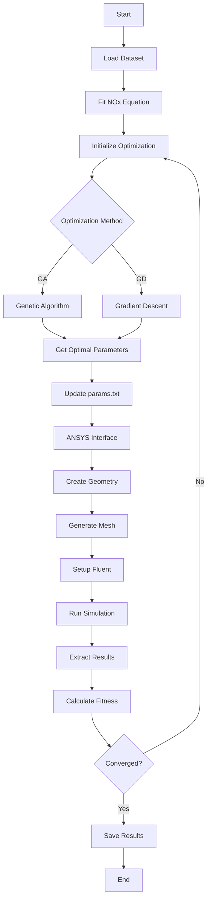

# Burner Parameter Optimization with ANSYS Integration

This project implements genetic algorithms and gradient descent to optimize burner parameters for maximizing heating value while minimizing NOx emissions, with direct integration to ANSYS for CFD simulation.

## Project Structure

- `data_processing.py`: Handles dataset loading and processing, NOx equation fitting, and fitness calculations
- `genetic_algorithm.py`: Implements the genetic algorithm optimization
- `optimization.py`: Implements gradient descent optimization
- `ansys_interface.py`: Manages ANSYS simulation integration
- `main.py`: Main script that runs both optimizations and saves results
- `params.txt`: Configuration file for simulation parameters
- `results.json`: Output file containing optimization results

## Workflow Diagram



## Dependencies

- Python 3.7+
- numpy
- pandas
- scipy
- openpyxl (for Excel file handling)
- ANSYS 2023R1 or later
- ANSYS Fluent
- ANSYS Mechanical APDL

## Usage

1. Place your dataset in an Excel file named `Dataset.xlsx` with columns:
   - position
   - temperature
   - concentration

2. Configure simulation parameters in `params.txt`:
```txt
sic3_porosity = 0.5
sic10_porosity = 0.5
preheating_length = 0.5
burner_diameter = 0.1
burner_length = 0.3
inlet_velocity = 0.5
inlet_temperature = 300
fuel_composition = CH4
equivalence_ratio = 0.8
```

3. Run the optimization:
```bash
python main.py
```

## ANSYS Integration Details

### Geometry Creation
- Creates a cylindrical burner geometry
- Defines two porous media regions (SiC3 and SiC10)
- Sets material properties based on porosity
- Generates appropriate mesh density

### Fluent Setup
- Configures energy and species transport models
- Sets up boundary conditions
- Defines material properties
- Configures solution methods

### Simulation Parameters
The following parameters can be adjusted in `params.txt`:

1. Geometry Parameters:
   - SiC3 porosity (0.1-0.9)
   - SiC10 porosity (0.1-0.9)
   - Preheating length (0.1-1.0 m)
   - Burner diameter (0.05-0.2 m)
   - Burner length (0.2-0.5 m)

2. Flow Parameters:
   - Inlet velocity (0.1-2.0 m/s)
   - Inlet temperature (300-500 K)
   - Fuel composition (CH4, H2, etc.)
   - Equivalence ratio (0.6-1.2)

## Results

Results are saved in `results.json` with the following structure:
```json
{
    "sheet_name": {
        "alpha_value": {
            "genetic_algorithm": {
                "parameters": [sic3_porosity, sic10_porosity, length],
                "fitness": fitness_value,
                "simulation_results": {
                    "temperature": [...],
                    "nox_concentration": [...],
                    "velocity": [...]
                }
            },
            "gradient_descent": {
                "parameters": [sic3_porosity, sic10_porosity, length],
                "fitness": fitness_value,
                "simulation_results": {
                    "temperature": [...],
                    "nox_concentration": [...],
                    "velocity": [...]
                }
            }
        }
    }
}
```

## Notes

- The ANSYS integration requires proper installation and licensing
- Simulation results are extracted from Fluent data files
- Mesh quality and convergence criteria can be adjusted in the APDL script
- The optimization process may take significant time due to CFD simulations
- Results should be validated against experimental data

## Troubleshooting

1. ANSYS Path Issues:
   - Verify ANSYS installation path
   - Check environment variables
   - Ensure proper licensing

2. Simulation Convergence:
   - Adjust mesh density
   - Modify solution parameters
   - Check boundary conditions

3. Optimization Issues:
   - Adjust population size
   - Modify mutation rate
   - Change learning rate
   - Update convergence criteria